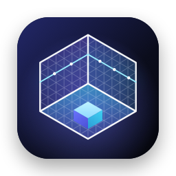

<p align="center"></p>

# ScanSpace — LiDAR 3D scanner for iPhone

ScanSpace turns an iPhone with a LiDAR Scanner (built for the **iPhone 15 Pro**) into a Polycam-style 3D scanner.
It installs straight from this repository's **GitHub Pages** site — no App Store involved.

| Mode | What you get |
| --- | --- |
| **LiDAR Mesh** | ARKit scene reconstruction + automatically picked photos → a **photo-textured 3D mesh**, a colored **point cloud** and surface labels (walls, floor, ceiling, furniture…) |
| **Room Plan** | Apple RoomPlan, **room by room** in one continuous session → a merged **apartment model** with doors, windows and furniture, **floor area**, and a dimensioned **2D floor plan** |

Everything runs on the phone: scanning, texture baking, point-cloud fusion and export.

- 3D viewer with orbit/zoom, **Texture / Solid / Wire / Labels / Points** styles, a **height cut** to look into rooms, top view, and **tap-to-measure**
- **AR Quick Look** to place the model in your room
- Export **GLB, USDZ, OBJ (+textures, zipped), PLY mesh, point cloud PLY, STL**, raw capture data, **floor plan PDF/PNG** and **RoomPlan JSON**
- Metric / imperial units, texture quality presets, white-balance lock for consistent textures

**ScanSpace Studio** is the macOS companion: open your scans on a Mac to view, clean, re-process and measure them,
and to extract an apartment **blueprint** from the mesh or point cloud ([details below](#scanspace-studio-for-mac)).

## Install on your iPhone (no App Store)

Open **[aabdlwahab.github.io/3d-scanner](https://aabdlwahab.github.io/3d-scanner/)** in Safari on the iPhone (it is
rebuilt by GitHub Actions on every push to `main`). iOS only runs apps signed by an Apple account, so the page offers
two ways in:

### Option 1 — free, with your own Apple ID (SideStore / AltStore)

Works on any LiDAR iPhone, no paid account needed. The page publishes an unsigned IPA plus a SideStore/AltStore
**source**, so updates show up automatically.

1. One-time setup: install [SideStore](https://sidestore.io) or [AltStore](https://altstore.io) on the iPhone (needs a Mac or PC once).
2. On the install page tap **SideStore** or **AltStore** (or add the `…/apps.json` source URL manually), then install ScanSpace.
3. Turn on **Settings › Privacy & Security › Developer Mode** when iOS asks.
4. Free Apple IDs sign apps for **7 days** — tap **Refresh** in SideStore/AltStore weekly. Scans are kept.

You can also download `ScanSpace-unsigned.ipa` from the page and install it with [Sideloadly](https://sideloadly.io).

### Option 2 — one-tap install from Safari (Apple Developer Program)

With a paid (or company) Apple Developer account the workflow also publishes a signed **Ad Hoc** build, and the page
shows an **Install ScanSpace** button (`itms-services` over-the-air install). No weekly refresh; the profile is valid for
a year. Setup, once:

1. **Register the iPhone:** connect it to a Mac, select it in Finder and click the text under its name until the
   **UDID** appears → copy it. Add it at [developer.apple.com › Devices](https://developer.apple.com/account/resources/devices/list).
2. **Create an App ID** (Identifiers › +), e.g. `com.yourname.scanspace`. No capabilities are needed.
3. **Create an "Apple Distribution" certificate.** Without Xcode:
   ```bash
   openssl req -new -newkey rsa:2048 -nodes -keyout scanspace.key -out scanspace.csr -subj "/CN=ScanSpace/emailAddress=you@example.com"
   ```
   Upload `scanspace.csr` under Certificates › + › Apple Distribution, download `distribution.cer`, then:
   ```bash
   openssl x509 -inform DER -in distribution.cer -out distribution.pem
   openssl pkcs12 -export -inkey scanspace.key -in distribution.pem -out scanspace.p12
   ```
   (macOS's built-in `openssl` works as is; with Homebrew's OpenSSL 3 add `-legacy` to the last command so the
   macOS keychain can import the file. Alternatively create the CSR with Keychain Access and export the certificate
   as `.p12` from there.)
4. **Create an Ad Hoc provisioning profile** (Profiles › + › Ad Hoc) for the App ID, certificate and your device; download it.
5. **Add the repository secrets** (Settings › Secrets and variables › Actions), e.g. with the GitHub CLI:
   ```bash
   base64 -i scanspace.p12 | gh secret set IOS_CERTIFICATE_P12
   gh secret set IOS_CERTIFICATE_PASSWORD        # the .p12 export password
   base64 -i ScanSpace_AdHoc.mobileprovision | gh secret set IOS_PROVISIONING_PROFILE
   ```
6. Re-run the **Build app & publish install page** workflow. The bundle ID and team are read from the profile.

To add more iPhones later, register them, regenerate the profile, and update `IOS_PROVISIONING_PROFILE`.

## ScanSpace Studio for Mac

<p></p>

A desktop app for the scans you capture on the iPhone (macOS 14 Sonoma or later, Apple silicon or Intel).

- **View** — textured, solid, wireframe, surface-label and point-cloud styles; height cut; top view; measuring.
  Point clouds hide the points facing away from you, like the mesh does, so you can look into rooms from above.
- **Clean** — crop box, rectangle select & delete, remove floating pieces, Taubin smoothing, statistical outlier
  removal and voxel downsampling for point clouds, and **Level & Align** (floor at 0, walls on the X/Z axes — done
  automatically the first time a LiDAR scan opens). Every edit is non-destructive and undoable; the original scan is
  never modified.
- **Process** — re-bake the photo textures from the raw capture at up to 4 × 8K on the Mac; edits are re-applied.
- **Blueprint** — finds the floor and ceiling, walls (with measured thickness where both sides were scanned), doors,
  openings, windows, rooms with areas, and furniture, from the labelled mesh *or* an unlabelled point cloud. Export a
  dimensioned **PDF / PNG / SVG / DXF (CAD)** plan, or a clean 3D model built from the plan (GLB, USDZ).
- **Export** — GLB, USDZ, OBJ (+textures), PLY, STL, point cloud PLY. **Import** PLY, OBJ, STL and USD/USDZ from other apps.

**Install:** download **ScanSpace Studio** from the [install page](https://aabdlwahab.github.io/3d-scanner/), unzip
it and drag it to Applications. It is ad-hoc signed but not notarized (that needs a paid Apple Developer account),
so macOS blocks the first launch: click **Done**, then **System Settings › Privacy & Security › Open Anyway**.
Or build it yourself with `scripts/dev/build-mac.sh` — only the Command Line Tools are needed, and a locally built
app opens without that prompt.

**Moving scans to the Mac:** on the iPhone open a scan › **Export › ScanSpace Studio (Mac)** and AirDrop the
`.scanspace` file (the whole project: model, point cloud, photos, depth and poses). It opens in Studio. Raw capture
zips and models from other apps can be dragged into the window, too. **File › New Sample Apartment** builds a
synthetic three-room scan to try everything without a phone.

## Scanning tips

- Move slowly, and sweep each area at chest height, low (furniture, floor) and high (ceiling).
- Keep surfaces 0.5–3 m away; turn the lights on. Mirrors and glass confuse LiDAR.
- **Apartments:** use *Room Plan*. Tap **Done with this room**, walk to the next room with the camera pointed at the
  floor, tap **Scan Next Room**, and **Finish** at the end — the rooms are merged into one model and floor plan.
- **Detail & textures:** use *LiDAR Mesh*. Processing (texturing + point cloud) takes roughly 10–60 s on an iPhone 15 Pro
  and continues in the background of the app.

## How it works

```
LiDAR Mesh ─ ARKit (sceneReconstruction + sceneDepth) ─┬─ ARMeshAnchors ──────────────► raw/mesh.bin
                                                        └─ KeyframeRecorder: sharp photos,
                                                           depth, pose, intrinsics ─────► raw/frames/*
Processing (on device, App/Sources/Core/Processing)
  MeshCleaner      weld chunk seams, fix winding, drop floating noise
  ViewSelector     per triangle: best photo by projected size, angle, occlusion (LiDAR depth) and blur;
                   neighbor smoothing to reduce seams
  TextureAtlas     group triangles per photo into compact charts, shelf-pack into 4K pages, bake from the JPEGs,
                   flood-fill colors into the few spots no photo saw
  PointCloud       fuse depth maps into a voxel grid with averaged colors
Room Plan ─ RoomCaptureView (shared ARSession, room by room) → StructureBuilder → FloorPlanData
  RoomSceneBuilder walls with real door/window openings, floor slabs, furniture → viewer, GLB/OBJ/STL
  FloorPlanCanvas  dimensioned plan (auto-aligned to the dominant wall direction) → screen, PDF, PNG
```

`App/Sources/Core` is platform-independent (Foundation, simd, CoreGraphics, SceneKit) and is tested on macOS;
`App/Sources/Features` holds the iOS UI, ARKit and RoomPlan code. ScanSpace Studio (`Mac/Sources`) is built from the
same core plus a macOS UI:

```
Editing (App/Sources/Core/Editing)
  EditOperation    crop, delete region, remove pieces, smooth, transform, point outliers/downsampling —
                   stored in edits.json and replayed on the original data (undo = replay one fewer)
Blueprint (App/Sources/Core/Blueprint)
  levels           floor/ceiling from labels or horizontal-surface histograms
  orientation      dominant wall direction (mod 90°) → axis-aligned plan
  walls            per-axis histogram peaks of wall-facing samples, kept only if they span the room height;
                   opposite faces paired for thickness; doorways and openings from gaps under a lintel
  rooms            occupancy grid → close, fill, label components between walls → outlines + areas
```

## Development

| Task | Command |
| --- | --- |
| Generate the Xcode project (needs Xcode 16+) | `brew install xcodegen && xcodegen generate && open ScanSpace.xcodeproj` |
| Test the processing/export core on macOS (only the Command Line Tools) | `scripts/dev/test-core.sh` |
| Build ScanSpace Studio without Xcode → `build/mac/ScanSpace Studio.app` | `scripts/dev/build-mac.sh` |
| Type-check the whole iOS app without Xcode (Mac Catalyst SDK) | `scripts/dev/typecheck.sh` |
| Regenerate the app and page icons | `swift scripts/dev/make-icons.swift` |

`test-core.sh` renders a synthetic textured room into fake LiDAR keyframes, runs the real pipeline and checks the baked
textures against ground truth, then validates every export format and the floor-plan maths (renders land in `Tests/.out/`).
It also scans a synthetic three-room apartment and checks the Studio engine: blueprint extraction against the known
walls, doors, windows and room areas (from the mesh and from a bare point cloud), every edit operation, the SVG/DXF
exports, model import and `.scanspace` archives.

CI (`.github/workflows/build.yml`) runs on every push to `main`: it generates the project, builds the unsigned IPA
(and the signed one when secrets exist) and the universal ScanSpace Studio app on a `macos-26` runner, and deploys
`site/` plus the IPAs, the Mac app zip, the OTA manifest and the SideStore/AltStore source to GitHub Pages.

**Requirements:** iPhone or iPad with LiDAR (iPhone 12 Pro and newer Pro models), iOS 17 or later.
ScanSpace Studio: macOS 14 or later.
